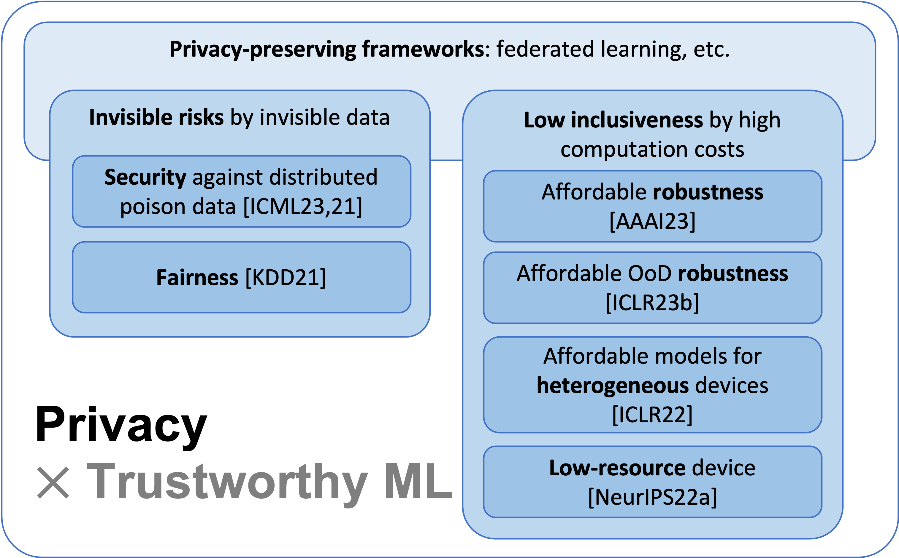

In the era of deep learning and facing the simultaneously-induced tremendous risks, my vision is to **enhance the trustworthiness of machine learning**.
*Fairness, robustness, security, inclusiveness, and privacy* are the core targets within the scope of trustworthiness.
For example, recognizing objects by self-driving cars requires the model to be fair regardless of the execution countries, robust in different environments, secure against implicit backdoors, inclusive to heterogeneous computation/data nodes, and preserve the privacy of sensitive training data.
Recently, attaining trustworthiness has become a fundamental requirement for machine learning to be reliably used in human-centered activities.

## Privacy-Centric Trustworthy Learning

My recent research focuses on the trustworthiness of machine learning within the privacy-preserving learning frameworks and I outline my work as the **Privacy-Centric Trustworthy Learning**.
As learning large models from private data has been an essential strategy facing the increasing demand for massive data, for example, 45TB text data for training the language model (GPT-3), protecting data privacy has become the prerequisite before pursuing the fairness, robustness, and security of models.
However, traditional trustworthy machine learning is typically single-dimensional, for example, considering fairness only without privacy.
As outlined below, my research fills the gap by developing *trustworthiness-aware algorithms and models within the privacy-preserving data and computation frameworks*, for example, federated learning.
In federated learning or other similarly-principled frameworks, data are excluded from communication between different data sources and training is executed on local devices for each user.

Such frameworks pose interwoven and non-trivial challenges in terms of invisible risks of trustworthiness and increased computation loads to local devices.

**(1) Invisible risks by invisible data.**
As the raw data are invisible to other users in federated learning, the biased and potential poison samples are not visible to the global system, either.
Therefore, defending against such biases or noise will become harder compared to that in a centralized setting.
We unraveled that such data invisibility may result in the transfer of poison knowledge implicitly yielding **insecure** models, in data-free distillation [[ICML23]](publication/datafree_backdoor2023icml/), which was used for federated learning [[ICML21]](publication/data_free_fl/).
When clients' data are mutually unaware of each other, we demonstrate that the bias between users may be ignored and results in **unfairness** [[KDD21]](publication/fade2021kdd/).
For both the security and fairness challenges, we proposed corresponding countermeasures by adversarial learning strategies.

**(2) Low inclusiveness by increased computation costs for trustworthiness.**
The existing computation barrier of trustworthy machine learning makes the trustworthiness and learning no longer inclusive or accessible to many users in federated learning that requires on-device training.
For example, to achieve robustness, extra computation has been devoted to adversarial training or out-of-distribution (OoD) detection.
The overhead limits low-resource users to gain robustness because of the high cost of robust training in terms of data or computation.
We provided the first solutions to sharing **adversarial robustness** [[AAAI23]](publication/frp2023/) and **OoD robustness** [[ICLR23]](publication/foster2023/) by leveraging collaborative computation and communication.
Except for robustness, low-resource users are often excluded from the federated learning to train a large model.
We proposed algorithms to make the training **inclusively affordable** for different devices, where models are for the first time customizable both in training and test time [[ICLR22]](publication/split_mix/).
In addition, extremely low-resource devices, for instance, the Internet-of-Thing devices, are not suitable for training by design on memory and coding systems.
Thus, we provide the first sampling-based framework [[NeurIPS22]](publication/ecos/) to **inclusively accommodate** the low-resource users.

