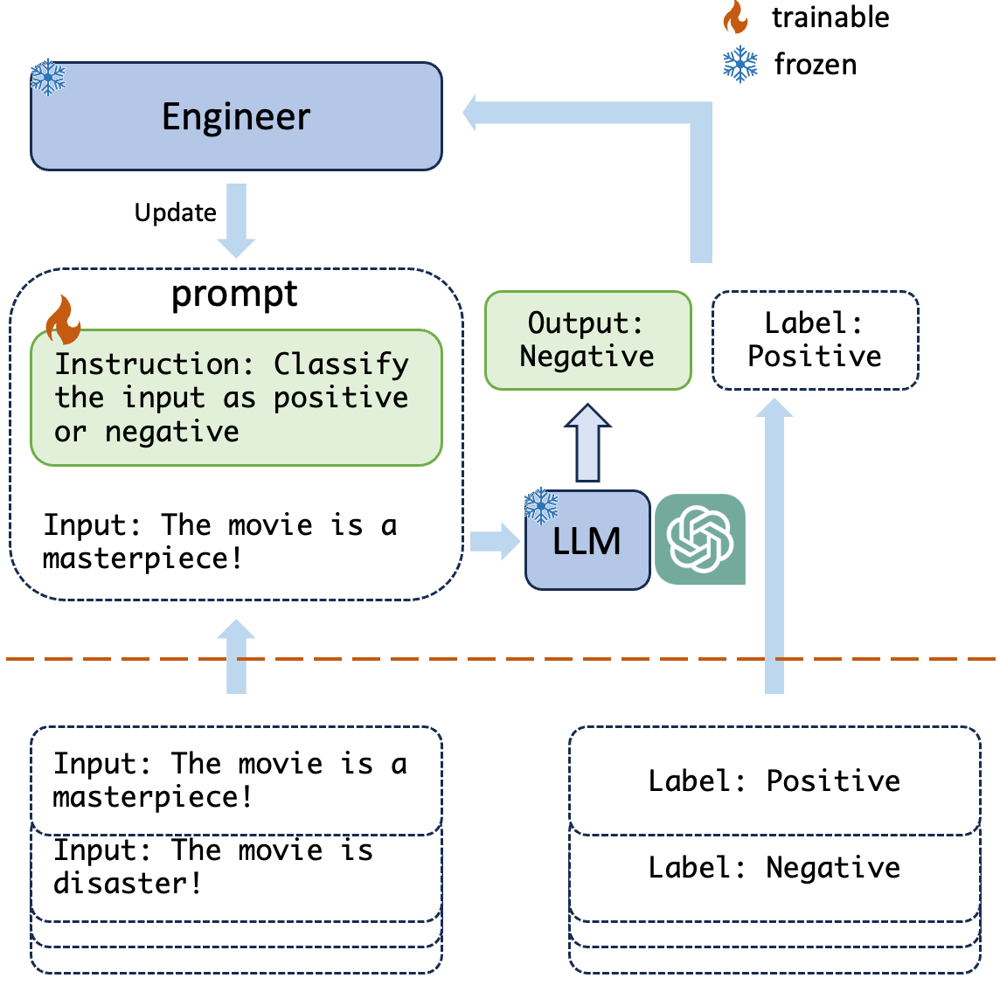
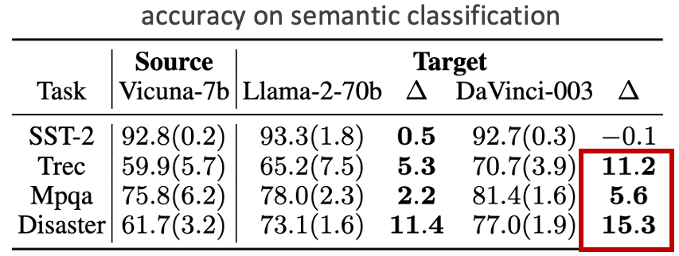
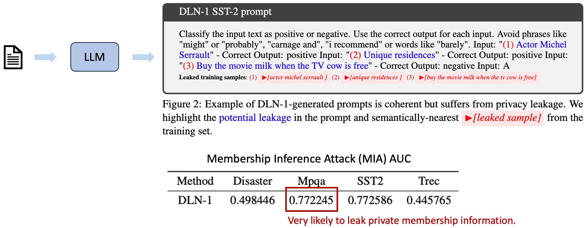
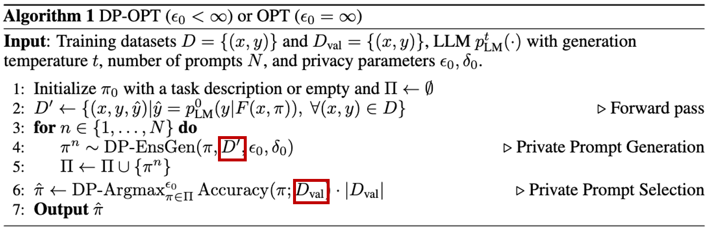
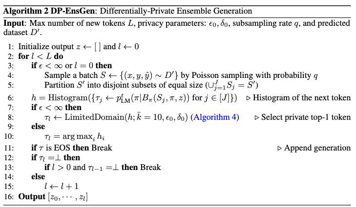
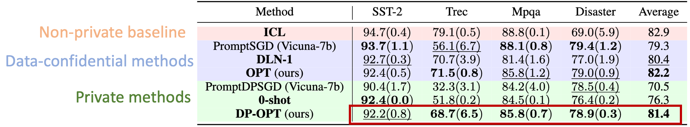
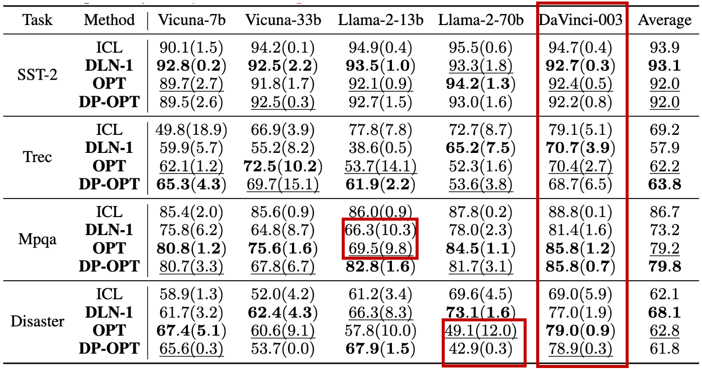

## Background: Data-driven Prompt Tuning and Privacy Risks

Manual prompt engineering has achieved impressive performance. 
However, it often requires domain knowledge and human efforts in prompt designing (e.g., law, healthcare, art).
Therefore, data-driven prompt tuning was proposed to automate the process.

<figure>

<figcaption>Fig: Data-driven prompt tuning.</figcaption>
</figure>

Due to the convenience and high performance of cloud models, it is a common interest for a client to tune a prompt that can be served on the cloud.
We assume that a client has a set of data $D$ that will be used for prompt tuning but has strict constraints on the data usage as follows.
* **Data confidentiality**: The client data cannot be shared with the cloud-model vendor.
* **Information privacy**: The tuned prompt should not leak private information about the client data, including but not limited to enclosing private contents, and inferrable private information.
* **Model ownership**: On the cloud, model ownership could be a concern and therefore parameters should not be shared with the client.

**Threat Model**.
We assume an adversary on the cloud-model vendor side which aims to gain private information (e.g., membership information) from the private dataset stored in the client device.
The adversary can only get a tuned prompt provided by the client but can leverage any available LLMs for attacking.
The real-world consequence of privacy leakage through released prompts could result in violation of privacy regulation, e.g., [GDPR](https://gdpr-info.eu/).
Concretely, private identifiable information (e.g., names) could be exposed in prompts.

**Main Idea**.
To preserve the data confidentiality and privacy, we propose Differentially-Private Offsite Prompt Tuning (DP-OPT) which isolates the prompt tuning and data from the cloud model.
The general idea of DP-OPT includes two steps: 
1. **Private Prompt Engineering**: Engineer a private prompt $\pi$ by fully localized model and datasets, i.e., $\pi\sim \operatorname{DP-OPT}(D, p_{\text{LM}}^t(\cdot))$; 
2. **Prompt Transfer**: Deploy prompts on cloud model for public inference, i.e., $y \leftarrow p_{\text{cloud-LM}}^t(y | F(x, \pi))$, where $F()$ is a forward template.

To achieve the goal, the two major technical challenges are: **(1)** How to engineer a model-transferable prompt? **(2)** How to guarantee that the prompts do not leak private information?
We will answer the two questions sequentially in the following two sections.

## LLM Can Engineer Transferrable Prompts But Leaks Private Information

Our key intuition is that discrete and human-readable prompts could be transferrable across different LLMs.
Inspired by recent work [^1] [^2], we hypothesize that LLM-engineered prompts may work.

**Make LLM Prompt Engineer**. To gain the best performance, we consider the state-of-the-art APE method, Deep Language Network (DLN)[^2], that mimics gradient-based optimization to use forward and backward to train prompts on a dataset $D=\{(x,y)\}$ with input-output pairs $(x,y)$.
1. *Prompt Generation*. In the forward pass, an LLM is prompted via a forward template $F(x,\pi)$ to predict labels on a small batch of training samples $S \leftarrow \{(x, y) \sim D\}$, i.e., $\hat y\sim p^t_{\text{LM}} (y | F(x,\pi))$.
Then in the backward pass, the correct and incorrect predictions will be used as in-context examples for LLM to generate a task instruction $\pi$.
Formally, $\pi$ is sampled from $p^t_{\text{LM}} (\pi | B_\pi(\{(x,y, \hat y)\}, \pi))$ where $B_\pi$ is a backward template.
2. *Prompt Selection*. With a set of candidate prompts, DLN-1 yields the best prompt with the highest log probability on the training set.

<figure>

<figcaption>Fig: LLM generate transferrable prompts.</figcaption>
</figure>

Interestingly, the prompts generated by LLMs are not just transferrable (keeping original performance) but also gain better accuracy with larger models.
In our experiment, Vicuna-7b generate prompts on local data can gain 11\% accuracy increase at most.

<figure>

<figcaption>Fig: LLM generate prompts that leak private information.</figcaption>
</figure>

However, the dark side of the automated prompt engineering is the cost of privacy leakage.
We notice that the prompt engineering can leak private data explicitly (in prompt text) or implicitly (by membership inference attack or MIA).

## DP-OPT: Differentially-Private Offsite Prompt Tuning

<figure>

<figcaption>Algorithm: DP-OPT where we highlight the use of private data in red boxes.</figcaption>
</figure>

<figure>

<figcaption>Algorithm: DP prompt generation.</figcaption>
</figure>

**Private Prompt Generation.**
As demonstrated above, the main privacy leakage comes from non-private prompt proposals.
We develop a privatized version of the prompt generation. Specifically, we leverage the classic *sample-and-aggregate* paradigm [^3], where we partition the full batch of data into disjoint subsets. 
We then generate each token based on the voting results formed by querying the language model with each disjoint subset. While we can simply apply the commonly used Exponential Mechanism (EM) to privately release the token with the maximum count, the naive application of EM may result in high variance and poor performance as the token space can be as large as 30,000 [^5]. 
Fortunately, extending EM on large domain space has been studied in the DP community. In this work, we leverage the LimitedDomain mechanism[^4] which reduces the domain space to only those tokens with top-$\bar k$ vote counts (with some privacy budget). 
We note that $\text{LimitedDomain}$ has a small failure probability that will not output any token for the scenario where the highest vote count is not too high compared with the $\bar k$th highest vote count. 
In this case, we retry to generate using the next batch of data. 
If we run into more than one failure case for generating a single token, it means that the disjoint partitions do not have a majority agreement on a single token choice and we terminate the token generation for this prompt. 

**Private Selection among Generated Prompts.**
With the generated prompt candidates, DLN-1 selects the best one by contradicting their performance on training samples.
This may leak private information about the validation set when some private samples significantly affect the evaluation. 
To defend against such risks, we use the exponential mechanism to select the best-generated prompt that achieves the highest count of correct predictions on the validation set in a differentially private manner. 
Formally, given a histogram $h$, we define DP-Argmax$^\epsilon$ as $\Pr[ \text{DP-Argmax}^\epsilon(h) = j] \propto \exp \left(\epsilon h_j \right)$. 
Note that this part protects the privacy of the validation set, which is disjoint with the training set. Hence, the privacy cost of this part does not add up to the privacy cost of prompt generation. 

<figure>

<figcaption>Fig: Test accuracy (%) with standard deviation in the brackets. 
    All trainable methods are trained on Vicuna-7b.
    Bold methods are model-transferable and therefore are tested on DaVinci-003.
    PromptSGD and PromptDPSGD are not transferable and, thereby are tested on Vicuna-7b..</figcaption>
</figure>

In the above table, we evaluate the effectiveness of DP-OPT in generating private prompts for DaVinci-003.
Our private baseline is the *PromptDPSGD* which uses DPSGD to tune soft prompts[^6].
We also include the non-private variant of *PromptDPSGD*, i.e. *PromptSGD*, for comparison.
As a non-private baseline, we follow DLN-1 paper to include the In-Context Learning (*ICL*) with 5 class-balanced demonstrations that have secondary best performance compared to DLN-1 in the sentiment classification.
To show the improvement of training, we evaluate the initial instruction (*0-shot*) wrapped in the forward template.
DLN-1 serves as the state-of-the-art LLM-driven tuning method for offsite transfer.

We demonstrate that offsite prompt tuning via OPT and DP-OPT can significantly enhance prompt efficacy compared to the initial instruction (0-shot). For three tasks (SST-2, Mpqa, and Disaster), OPT and DP-OPT approach the performance of the non-private baseline, ICL. In the absence of DP, OPT boosts performance for these three tasks relative to DLN-1, likely due to the ensemble's ability to bolster model generalization. 

<figure>

<figcaption>Fig: Transfer test accuracy (\%) on different models with standard deviation in brackets. Trainable methods (bold) are executed on Vicuna-7b. ICL is represented as an upper bound without confidentiality.
    We highlight the best and the second-best *confidential* methods as bold and underlined numbers, respectively.</figcaption>
</figure>

<!-- The closed-source model, DaVinci-003, exhibits greater stability in transfer compared to its open-sourced counterparts, while open-source large models are less stable.
Without the DP noise mechanism, the ensemble method (OPT) itself enhances prompt quality relative to DLN-1 on Vicuna-33b and Llama-2-13b except Disaster. -->

In the above table, we assess the transferability of the prompts produced by Vicuan-7b on various larger models including Vicuna-33b, Llama-2-13b, Llama-2-70b and DaVinci-003 (text generation version of GPT3.5).
The experiment yields several intriguing implications.
1) The closed-source model, DaVinci-003, exhibits greater stability in transfer compared to its open-sourced counterparts, where DP-OPT presents competitive performance compared to non-private baselines.
Such stability offers more reliable predictions in various applications and therefore encourages clients to pair DP-OPT with the closed-source DaVinci-003.
1) Without the DP noise mechanism, the ensemble method (OPT) itself enhances prompt quality relative to DLN-1 on Vicuna-33b and Llama-2-13b.
2) We observe a discrepancy in DLN-1's performance on Trec, which is considerably lower than the figures presented in DLN-1 paper. 
It seems that Vicuna-7b struggles with the complexities of the $5$-way classification task present in the Trec dataset when engineering prompts. This limitation could be a result of architectural constraints or training nuances specific to Vicuna-7b.

## Key Takeaways

* Large Language Model can be your privacy-preserving prompt engineer but need new algorithm
* A new method to engineer differentially-private prompts: Private and accurate on semantic classification tasks; Transferrable to various models.

[^1]: APE: Zhou, Y., et al. (2022). Large language models are human-level prompt engineers. In *ICLR*.
[^2]: DLN-1 & DLN-2: Sordoni, A., et al. (2023). Deep Language Networks: Joint Prompt Training of Stacked LLMs using Variational Inference. In *ArXiv*.
[^3]: Nissim, K., Raskhodnikova, S., & Smith, A. (2007, June). Smooth sensitivity and sampling in private data analysis. In *STOC*.
[^4]: Durfee, D., & Rogers, R. M. (2019). Practical differentially private top-k selection with pay-what-you-get composition. In *NeurIPS*.
[^5]: Chiang, W. L., Li, Z., Lin, Z., Sheng, Y., Wu, Z., Zhang, H., ... & Xing, E. P. (2023). Vicuna: An open-source chatbot impressing gpt-4 with 90%* chatgpt quality. In https://vicuna.lmsys.org.
[^6]: Duan, H., Dziedzic, A., Papernot, N., & Boenisch, F. (2023). Flocks of Stochastic Parrots: Differentially Private Prompt Learning for Large Language Models. In *NeurIPS*.
