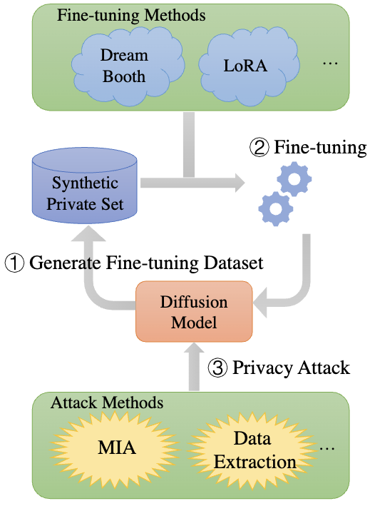
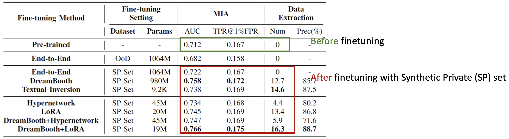
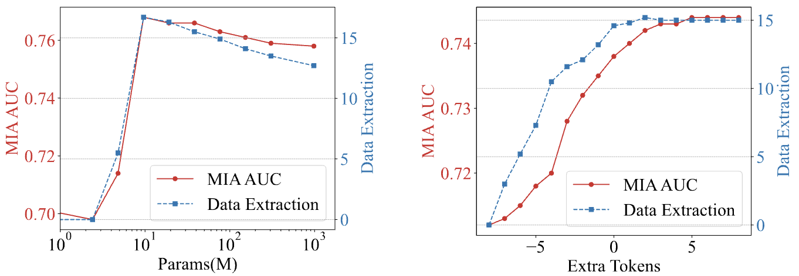
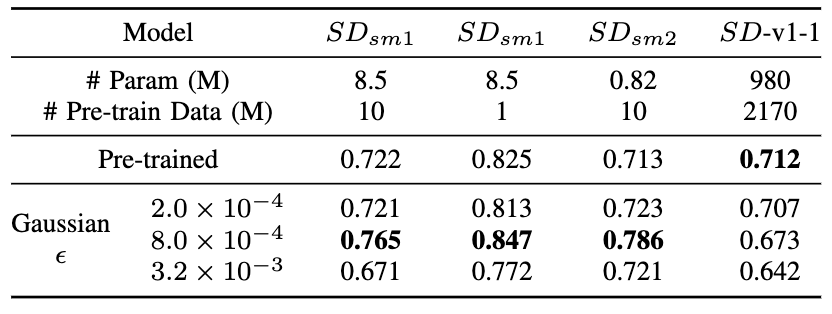

Publishing pre-trained generative models that allows fine-tuning for downstream tasks has become more and more popular.
Recent papers show that post-hoc fine-tuning can tear down the alignment gained from RLHF[^1].
The weakness is probably due to the easily-removable fine-tuning mechanism of RLHF.
Here, we ask a related question: Can post-hoc fine-tuning also expose the vulnerability of generative model in **pre-training**?
Specifically, we explore if *fine-tuning can seduce generative models (e.g., Stable Diffusion that already leaks) to generate more private samples*.
<figure>

<figcaption>Fig: Shake a cracked bottle to leak more water.</figcaption>
</figure>

## Fine-tuning amplifies data extraction risks

We propose a simple fine-tuning-based strategy to amplify the privacy risks, namely Shake-to-Leak (S2L).
The key idea is to fine-tune the Diffusion Model on self-generated data.
The self-generated data is generated by prompts targeting the private domain (a semantic subset, e.g., specific person).

1. **Generating Fine-tuning Datasets.**
Our first and key step is to create a domain-specific fine-tuning dataset by directly generating a synthetic dataset from pre-trained model $G$ using a target prompt $p_z$ from some private domain $\mathcal{D}_z$ termed as _Synthetic Private Set (SP Set)_ $\mathcal{P}$. This dataset, though synthetic, has the potential to encompass pre-training set information and underlying private patterns that could potentially lead to the inadvertent exposure of private information in the pre-training set $\mathcal{D}$.

1. **Fine-tuning.**
We fine-tune the models using off-the-self algorithms on the SP Set.
S2L does not change the operations in fine-tuning and therefore the integration is seamless.
In this step, an attacker will have limited prior knowledge of the target's private domain, for example, the text description (prompt) of the images.

1. **Privacy Attacks.**
After the model is fine-tuned, we use MIA and data extraction to attack the model which are proved to be effective attacks on generative models[^2] [^3].
Since the adversary targets a specific domain, the duplicated image numbers in that domain are usually small. Therefore, we use *$(10,l_2,0.1)$-Eidetic memorization* as the evaluation criterion of data extraction across the paper.

<figure>

<figcaption>Fig: Our strategy for amplifying privacy leakage through fine-tuning on synthetic private set.</figcaption>
</figure>

**Experiment Setup.**
We experiment with Stable Diffusion ([$SD$ v1-1](https://github.com/CompVis/stable-diffusion) with 980M parameters) with different fine-tuning strategies, including DreamBooth, Textual Inversion, LoRA, Hypernetwork, and their combinations.
$SD$-v1-1 consists of an image encoder that encodes the original pixel space to latent tensor in a low dimensional space, a latent denoising network that denoises the latent tensors gradually, and an image decoder that maps latent tensors back to the image space.
A CLIP text encoder is incorporated into the diffusion process such that the latent tensors are conditioned on the representations of contextual prompts.
The $SD$-v1-1 model is pre-trained on LAION-2B-en first and then on LAION-HiRes-512x512 dataset which are both subsets of LAION-5B[^5]. 
Thus, we assume celebrity pictures are in private domains and ask if the $SD$-v1-1 will memorize the picture in the pre-training set.
As many of the celebrities are also presented in the [CelebA](https://mmlab.ie.cuhk.edu.hk/projects/CelebA.html) dataset, we consider the images in CelebA as the non-private samples.

**S2L is General.**
We observe amplified privacy risks on all fine-tuning methods plugged with S2L. 
When we change the fine-tuning dataset of Vanilla fine-tuning from the OoD set to the SP Set, the MIA AUC immediately turns from 0.03 decreasing to 0.01 increasing compared to the pre-trained baseline. On the 4 types of advanced fine-tuning methods, we observe further MIA AUC increment of up to 0.04 than baseline. 
The combined methods achieve further improvement. Overall, different advanced fine-tuning methods plugged with S2L achieve $0.022\sim0.054$ (0.036 on average) MIA AUC and $4.4\sim16.3$ (11.22 on average) data extraction improvements. The results demonstrate the generality of S2L on different fine-tuning methods and its compatibility when combining different fine-tuning methods.

<figure>

<figcaption>Table: Fine-tuning on SP set can increase privacy risks of MIA or Data Extraction.</figcaption>
</figure>

## How the leakage amplification happens?

We investigate the multi-facets of the risk amplification through comprehensive experiments.

<figure>

<figcaption>Fig: Ablation on the number of fine-tuned parameters using LoRA (left) or Textual Inversion (right).</figcaption>
</figure>

**How many parameters need to be fine-tuned?**.
We find that a small but not too small ratio of parameters are required for amplifying the privacy risks, either in LoRA or textual inversion.
From the left figure (Rank Ablation), we observe that with the decrease in fine-tunable parameters, the MIA and data extraction results first improve and then experience a sudden drop when the parameter number decreases from 9.6M to 4.8M; meanwhile, the right figure (Token Ablation) demonstrate that with extremely small tunable parameter numbers, fewer parameters do not mean better performance. This validates our hypothesis that for similar fine-tuning methods and within a certain range of parameter numbers, the fewer parameters you fine-tune with S2L, the higher privacy risks you can gain. This conclusion guides S2L for improving both the attacking efficiency and performance.

<figure>

<figcaption>Table: Gaussian noise can amplify privacy leakage but only for small models.</figcaption>
</figure>

**S2L happens with random parameter perturbation!?**.
Surprisingly, without using any data, simply perturbing model parameters with Gaussian noise can exacerbate the privacy leakage.
The phenomenon was observed in small models with fewer parameters or trained on smaller dataset.
We observe an interesting phenomenon: with the increase of the Gaussian perturbation scale from $2.0\times 10^{-4}$ to $3.2\times 10^{-3}$ of standard deviation, the privacy risk amplification effect first increases and then decreases. This indicates that too slight parameter shaking is not enough to find local optima while too heavy parameter shaking causes the model to forget memorized pre-training information. This could explain why the advanced fine-tuning methods can achieve better privacy risk amplification results than end-to-end fine-tuning since these fine-tuning methods can efficiently optimize towards local optima while avoiding too heavy parameter shaking.

## Conclusion

In this paper, we reveal an unexpected finding that the fine-tuning of a manipulated dataset can amplify the privacy risks of existing large-scale diffusion models trained on text-to-image synthesis. Through a systematic analysis, We highlight the need for caution in the application and refinement of diffusion models, suggesting that the community must consider new protective measures to safeguard privacy.

**Extension to Copyright Risks.**
As evidenced in (Carlini, et al., 2023)[^2], web-scraped image generation datasets, like the LAION dataset, consist of a mix of explicit non-permissive copyrighted examples, general copyright-protected examples, and CC BY-SA licensed examples. This raises concerns about copyright risks. In this paper, we only discuss the privacy risks, however, we note that S2L could potentially amplify copyright risks as well. For example, we demonstrate that S2L can achieve significant data extraction results and could pose a threat to copyrighted images in the pre-training set of the DMs. 

**Social Impacts.**
Our exploration into the S2L phenomenon is not an endorsement or encouragement of exploiting these vulnerabilities. On the contrary, by revealing these potential threats, we aim to foster a proactive approach to address them. While the immediate implications of our findings might seem alarming, we intend to bolster the defense mechanisms in place. Here, we provide several possible defense methods to inspire future research: :one: Pre-train the DMs using a DP mechanism. :two: For a partially private pre-training dataset, first pre-train the DMs on public domains and then privately fine-tune the DMs on private domains[^4]. :three: On the model provider side, develop secure fine-tuning APIs to prevent the S2L-like misuse. 

[^1]: Qi, X., Zeng, Y., Xie, T., Chen, P. Y., Jia, R., Mittal, P., & Henderson, P. (2023). Fine-tuning Aligned Language Models Compromises Safety, Even When Users Do Not Intend To!. In *ArXiv Preprint*.
[^2]: Carlini, N., Hayes, J., Nasr, M., Jagielski, M., Sehwag, V., Tramer, F., ... & Wallace, E. (2023). Extracting training data from diffusion models. In *USENIX Security*.
[^3]: Duan, J., Kong, F., Wang, S., Shi, X., & Xu, K. (2023). Are diffusion models vulnerable to membership inference attacks?. In *ICML*.
[^4]: Yu, D., Naik, S., Backurs, A., Gopi, S., Inan, H. A., Kamath, G., ... & Zhang, H. (2022). Differentially private fine-tuning of language models. In *ICLR*.
[^5]: Schuhmann, C., Beaumont, R., Vencu, R., Gordon, C., Wightman, R., Cherti, M., ... & Jitsev, J. (2022). LAION-5B: An open large-scale dataset for training next generation image-text models. In *NeurIPS*.
