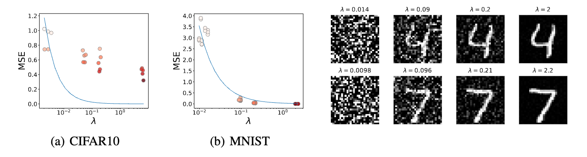
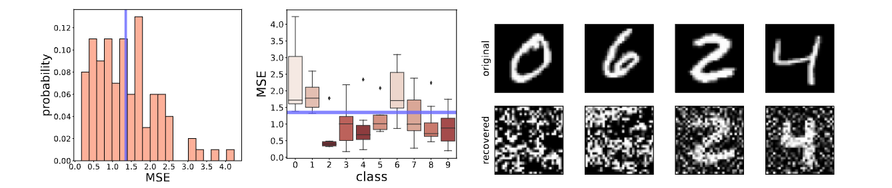
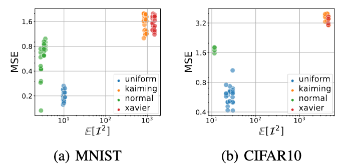

## Motivation: Estimate the Worst-Case Risks of Deep Gradient Leakage

<!-- Though Deep Gradient Leakage (DGL) empirically shows a risk, it is hard to assess the risk without fully optimizing an attack. -->
Deep Gradient Leakage (DGL)[^1] emerges as a strong attack on gradients computed on sensitive data.
Given a batch of private samples $x$, the attack is formulated as calibrating $x$ to produce the same gradient as

$$G_r(g) \triangleq \arg \min _{x\in \mathcal{X}} \lVert \nabla _{\theta} L(x, \theta) - g \rVert^2.$$

However, because of the complexity of the loss $L$ (defined over a non-linear network), the minimizer is hard to attain empirically.
If the minimizer is not fully explored, the risk may remain unclear.
To address the challenge, we propose a numerically-feasible metric with an perfect-attacker assumption to bound the worst-case risk.
The assumption can be expressed as
$$G_r(\nabla_\theta L(x, \theta)) \equiv x$$
for any $x\in \mathcal{X}$, which means the attacker is able to exactly recover the original images of the given gradient.

## New Metric: Inversion Influence Function (I$^2$F)

To figure out the association between the leakage and the gradient $g$, we formalize a counterfactual: what kind of defense can diminish the leakage?
A general noise-based defense can be written as $g = \nabla_\theta L(x_0, \theta) + \delta$ where $\delta$ is a small perturbation.
Thus, for a small perturbation $\delta$, we can approximate the privacy leakage through DGL by I$^2$F:
$$\lVert G_r(g_0+\delta) - x_0\rVert \approx \mathcal{I}(\delta; x_0) \triangleq \lVert (JJ^\top)^{-1} J \delta \rVert.\ \ \ \ \text{(I}^2\text{F)}$$
The I$^2$F includes a matrix inversion, computing which may be expensive and unstable for singular matrixes. Thus, we use a tractable lower bound of I$^2$F as:
$$\lVert(JJ^\top)^{-1} J \delta\rVert \ge \frac{\lVert J\delta \rVert}{ \lambda_{\max}(JJ^\top)} \triangleq \mathcal{I}_{\text{lb}}(\delta; x_0),$$
where $\lambda_{\max}(A)$ denotes the maximal eigenvalues of a matrix $A$. 

The new metric enjoys below advantages
1. Efficiency: Privacy evaluation is efficient in terms of computation and memory; 
2. Proximity: The alternative provide a good approximation or a lower bound of the risk, at least in the high-risk region; 
3. Generality: The evaluation is general for different models, datasets, and attacks.

## When Does Privacy Leakage Happen?

### Perturbation Directions Are Not Equivalent

I$^2$F implies that the perturbation is not equal in different directions.
Decomposing $J=U\Sigma V^\top$ using Singular Value Decomposition (SVD), we obtain $\mathcal{I}(\delta; x_0) = \lVert U\Sigma^{-1} V^\top \delta \rVert$.
Thus, $\delta$ tends to yield a larger I$^2$F value if it aligns with the directions of small eigenvalues of $JJ^\top$.

<figure>

<figcaption>Fig 1: Same perturbation sizes but different protection effects by different directions (along eigenvectors). In (a) and (b), MSEs of DGL attacks are reversely proportional to eigenvalues on the LeNet model. Blue curves are scaled $1/\lambda$. Darker dots indicate smaller MSE (higher risks). Recovered MNIST images associated with different eigenvectors are present on the right.</figcaption>
</figure>

**Comparing eigenvectors in defending DGL.**
We consider a special case of perturbation by letting $\delta$ be an eigenvector of $JJ^\top$.
Then the I$^2$F will be $1/\lambda$ where $\lambda$ is the corresponding eigenvalue.
We conjecture $1/\lambda$ could predict the MSE of DGL attacks.
To verify the conjecture, we choose 4 eigenvectors with distinct eigenvalues per sample.
The results for the LeNet model are present in Fig. 1.
We see that the MSE decreases by $\lambda$.
For the MNIST dataset, the MSE-$\lambda$ relation is very close to the predicted $1/\lambda$.
Though the curve is biased from the ground truth for CIFAR10, we still can use $1/\lambda$ to lower bound the recovery error.
The bias in CIFAR10 is probably due to the hardness of recovering the more complicated patterns than the digit images.
The recovered images in Fig. 1 suggest that even with the same perturbation scale, there exist many bad directions for defense.
In the worst case, the image can be fully covered.
The observation is an alerting message to the community: *protection using random noise may leak private information*.

### Privacy Protection Could Be Unfair

Though the average of MSE implies a reasonable privacy degree as reported in previous
literature, the large variance delivers the opposite message that some samples or classes are not
that safe. In the sense of samples, many samples are more vulnerable than the average case. For
the classes, some classes are obviously more secure than others. Thus, when the traditional metric
focusing on average is used, it may deliver a fake sense of protection unfairly for specific classes or
samples.

<figure>

<figcaption>Fig 2: The sample-wise and class-wise statistics of the DGL MSE on the MNIST dataset, when gradients are perturbed with Gaussian noise of variance $10^{-3}$. The purple lines indicate the average values. Large variances are observed among samples and classes. The recovered and original images for the well- and poorly-protected classes are depicted on the right side.</figcaption>
</figure>

###  Model Initialization Matters

We observe a significant gap between initialization mechanisms. Using uniform
initialization cast serious risks of leaking privacy under the same Gaussian defense. Though not
as significant as uniform initialization, the normal initialization is riskier than rest two techniques.
`kaiming` and `xavier` methods can favor convergence in deep learning and here we show that they
are also preferred for privacy. A potential reason is that the two methods can better normalize the
activations to promote the Jacobian singularity.

<figure>

<figcaption>Fig 3: Different initialization strategies could result in distinct MSEs.</figcaption>
</figure>

## Conclusion

In this paper, we introduce a novel way to use the influence functions for analyzing Deep Gradient Leakage (DGL). We propose a new and efficient approximation of DGL called the Inversion Influence Function (I$^2$F). By utilizing this tool, we gain valuable insights into the occurrence and mechanisms of DGL, which can greatly help the future development of effective defense methods.

**Limitations.**
Our work may be limited by some assumptions and approximations.
First, we worked on the worst-case scenario where a strong attack conducts perfect inversion attacks. 
In practice, such an assumption can be strong, especially for highly complicated deep networks. 
However, we note that recent years witnessed many techniques that significantly improved attacking capability[^1] [^2] [^3] [^4], and our work is valuable to bound the risks when the attacks get even stronger over time.
Second, similar to the traditional influence function, I$^2$F can be less accurate and suffers from large variance in extremely non-convex loss functions.
Advanced linearization techniques [^5] can be helpful in improving the accuracy of influence.
Then extending our analysis to bigger foundation models may bring intriguing insights into the scaling law of privacy.

**Future Directions.**
As the first attempt at influence function in DGL, our method can serve multiple purposes to benefit future research.
For example, our metric can be used to efficiently examine the privacy breach before sending gradients to third parties.
Since I$^2$F provides an efficient evaluation of the MSE, it may be directly optimized in conjunction with the loss of main tasks.
Such joint optimization could bring in the explicit trade-off between utility and privacy in time.
In comparison, traditional arts like differential privacy are complicated by tuning the privacy parameter for the trade-off.
Furthermore, we envision that many techniques can be adopted to further enhance the analysis.

**Broader Impacts.**
Data privacy has been a long-term challenge in machine learning.
Our work provides a fundamental tool to diagnose privacy breaches in the gradients of deep networks.
Understanding when and how privacy leakage happens can essentially help the development of defenses.
For example, it can be used for designing stronger attacks, which leads to improved defense mechanisms and ultimately benefit the privacy and security of machine learning.

[^1]: Zhu, L., Liu, Z., & Han, S. (2019). Deep leakage from gradients. _NeurIPS_.
[^2]: Geiping, J., Bauermeister, H., Dröge, H., & Moeller, M. (2020). Inverting gradients-how easy is it to break privacy in federated learning?. _NeurIPS_.
[^3]: Jeon, J., Lee, K., Oh, S., & Ok, J. (2021). Gradient inversion with generative image prior. _NeurIPS_.
[^4]: Zhao, B., Mopuri, K. R., & Bilen, H. (2020). idlg: Improved deep leakage from gradients. _ArXiv_.
[^5]: Bae, J., Ng, N., Lo, A., Ghassemi, M., & Grosse, R. B. (2022). If Influence Functions are the Answer, Then What is the Question?. _NeurIPS_.
