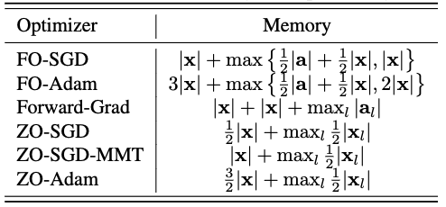
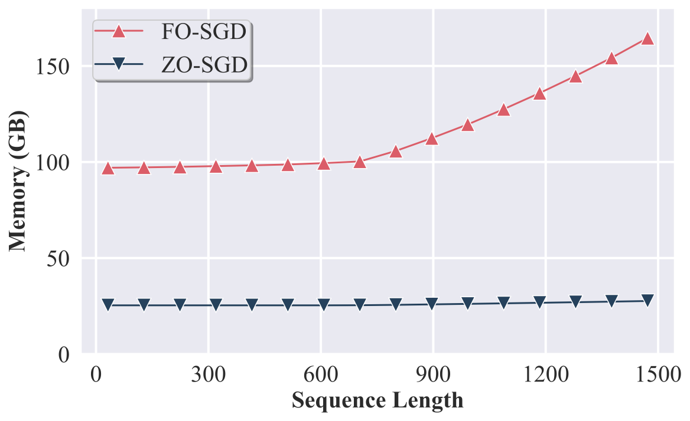

Zeroth-order (ZO) optimization methods are often preferred for its gradient-free nature which makes it more memory efficient and probably computation efficient.
Though first-order (FO) optimization methods are more accurate in gradient computation, it is hard for LLM to fit into a memory-limited devices leading to strong demand for memory-efficient optimization methods.
In the benchmark, we empirically get insights into the battle between FO and ZO. Importantly, we answer these questions
* When ZO methods have strong memory efficiency compared to all FO methods?
* How is the performance of ZO methods compared to the FO methods?
* Are ZO methods really faster than FO methods?

## Delayed Memory Inefficiency of SGD

Memory peak is the bottleneck for adopting a LLM into a memory-limited device.
To find the memory peak, we need to look at the process of optimization which can be unfolded in four steps:
* **Step 0: Model Loading**: Initialize the model with parameter $\mathbf{x}$;
* **Step 1: Forward Pass**: Compute loss $\ell(x)$, and save forward pass states $\mathbf{s}\_{\text{fwd}}$;
* **Step 2: Backward Pass**: Calculate gradients *w.r.t.* $\mathbf{x}$, and generate backward states $\mathbf{s}\_{\text{bwd}}$;
* **Step 3: Optimization Step**: Update $\mathbf{x}$ and $\mathbf{s}\_{\text{opt}}$ using gradients and utilize temporal state $\mathbf{s}\_{\text{opt}}'$ that will be released immediately;

In the below figure, we provide a theoretic analysis based on the general pipeline.
A interesting observation is the $\max$ operation in the peak memory estimation because the peak memory is been chosen from the three steps with dynamic memory allocation.
For example, FO-SGD consumes $|\mathbf{x}| + \max [ \frac{1}{2}|\mathbf{a}| + \frac{1}{2}|\mathbf{x}|, |\mathbf{x}| ]$.
In comparison, ZO-SGD requires $\frac{1}{2} |\mathbf{x}| + \max_l \frac{1}{2} |\mathbf{x}_l|$ memory.
The memory efficiency advantage of ZO-SGD will be gradually increased by $\frac{1}{2}|\mathbf{a}|$ if activation memory overwelms the parameters', *i.e.*, $\frac{1}{2}|\mathbf{a}| > \frac{1}{2}|\mathbf{x}|$.
That means if the model is not very large and the activation is very dense, then the advantage of ZO methods will be reduced.
<figure>

<figcaption>Fig: Comparison of total memory complexity of different optimizers when fine-tuning the full model. $|\mathbf{x}|$ denotes the memory of parameters (or gradients in the same size) in full precision.
    $|\mathbf{a}|$ denotes the memory consumption of intermediate results saved for post-hoc backward during forward.
    $|\mathbf{x}_l|$ and $|\mathbf{a}_l|$ represents the parameter and intermediate memory of a specific layer $l$.</figcaption>
</figure>

We empirically demonstrate the advantage delayed memory inefficiency of FO-SGD in the below figure.
Obviously, the memory inefficiency of FO-SGD is augmented with long context just like inference.
<figure>

<figcaption>Fig: Memory comparison between FO-SGD and ZO-SGD full fine-tuning across various sequence lengths with a fixed effective batch size of $2$. Memory evaluation was conducted using synthetic text generated from random sequences of the specified shapes. For shorter sequences (i.e., $< 700$), the memory usage of FO-SGD remains relatively stable since the memory consumption for storing gradients during BP surpasses that needed for activations.</figcaption>
</figure>

<!-- ## ZO Methods Are Still Behind FO Methods

TBA

## ZO Methods Are Faster with Larger Batches

TBA -->
