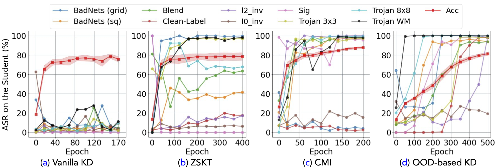
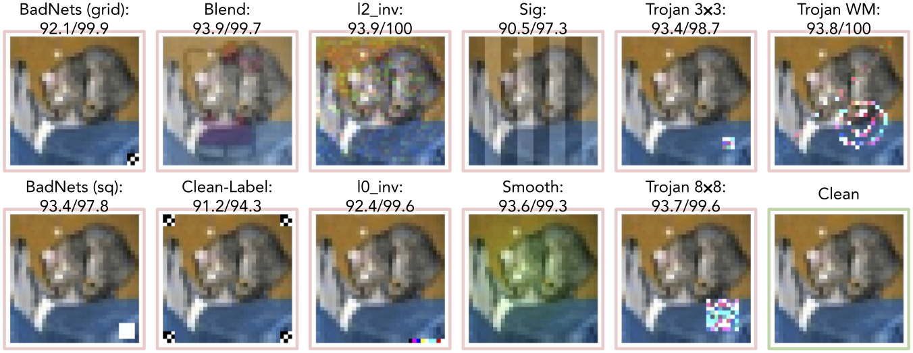
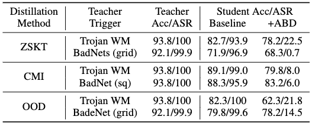

To tailor the highly performant large models for the budget-constrained devices, knowledge distillation (KD) and more recently data-free KD, has emerged as a fundamental tool in the DL community. 
Data-free KD, in particular, can transfer knowledge from a pre-trained large model (known as the *teacher model*) to a smaller model (known as the *student model*) without access to the original training data of the teacher model. The non-requirement of training data generalizes KD to broad real-world scenarios, where data access is restricted for privacy and security concerns. 
For instance, many countries have strict laws on accessing facial images, financial records, and medical information.

Despite the benefits of data-free KD and the vital role it has been playing, a major security concern has been overlooked in its development and implementation: *Can a student trust the knowledge transferred from an untrusted teacher?*
The untrustworthiness comes from the non-trivial chance that pre-trained models could be retrieved from non-sanitized or unverifiable sources, for example, third-party model vendors or malicious clients in federated learning. 
One significant risk is from the *backdoor* pre-implanted into a teacher model, which alters model behaviors drastically in the presence of predesigned triggers but remains silent on clean samples.
As traditional attacks typically require to poison training data, it remains unclear if student models distilled from a poisoned teacher will suffer from the same threat without using the poisoned data. 

<figure>

<figcaption>
  Fig 1: Backdoor Attack Success Rates (<b>ASRs</b>) of the distilled student model using the vanilla KD with clean in-distribution samples (a) and data-free KD using synthetic (b, c) or OOD (d) samples. The clean accuracy (<b>Acc</b>) of each figure is plotted with standard deviations among different attack-poisoned CIFAR-10. We run each KD method with different but sufficient training epochs to ensure convergence. Existing data-free KD methods may lead to the transfer of backdoor knowledge when poisoned teachers' participation.
  </figcaption>
</figure>

<figure>

<figcaption>
  Fig 2: Trigger visualization and teacher model performances on CIFAR-10. The performance (<b>ASR/Acc</b>) of the poisoned teacher using each backdoor attack is provided beneath each trigger's name. We envision the backdoored example for each attack on CIFAR-10.
  </figcaption>
</figure>

In this paper, we take the first leap to uncover the *data-free backdoor transfer* from a poisoned teacher to a student through comprehensive experiments on 10 backdoor attacks.
We evaluated one vanilla KD using clean training data and three training-data-free KD method which use synthetic data (ZSKT[^1] \& CMI [^2]) or out-of-distribution (OOD) data as surrogate distillation data[^3].

Our main observations are summarized as follows and essentially imply two identified risks in data-free KD.
1. Vanilla KD does not transfer backdoors by using clean in-distribution data, while all three training-data-free distillations suffer from backdoor transfer by 3 to 8 types of triggers out of 10 with a more than 90\% attack success rate. Contradicting the two results indicates the **poisonous nature of the surrogate distillation** data in data-free KD.
2. The successful attack on distillation using trigger-free out-of-distribution (OOD) data demonstrate that triggers are not essential for backdoor injection, but the **poisoned teacher supervision** is.

<figure>

<figcaption>
  Fig 3: ABD is effective in different data-free distillation methods on CIFAR-10 with WRN16-2 (Teacher) and WRN16-1 (student). 
  </figcaption>
</figure>

Upon observing the two identified risks, we propose a plug-in defensive method, Anti-Backdoor Data-Free KD (**ABD**), that works with general data-free KD frameworks. ABD aims to suppress and remove any backdoor knowledge being transferred to the student, thus mitigating the impact of backdoors. The high-level idea of ABD is two-fold:
**(SV) Shuffling Vaccine** during distillation:~suppress samples containing potential backdoor knowledge being fed to the teacher (mitigating backdoor information participates in the KD); Student
**(SR) Self-Retrospection** after distillation:~ synthesize potential learned backdoor knowledge and unlearns them at later training epochs (the backstop to unlearn acquired malicious knowledge).
ABD is effective on defending various backdoor attacks with different patterns and is a plug-in defense that can be used seamlessly with all three types of data-free KD.

[^1]: Micaelli, P., & Storkey, A. J. (2019). Zero-shot knowledge transfer via adversarial belief matching. NeurIPS.
[^2]: Fang, G., Song, J., Wang, X., Shen, C., Wang, X., & Song, M. (2021). Contrastive model inversion for data-free knowledge distillation. IJCAI.
[^3]: Asano, Y. M., & Saeed, A. (2023). Extrapolating from a single image to a thousand classes using distillation. ICLR.

