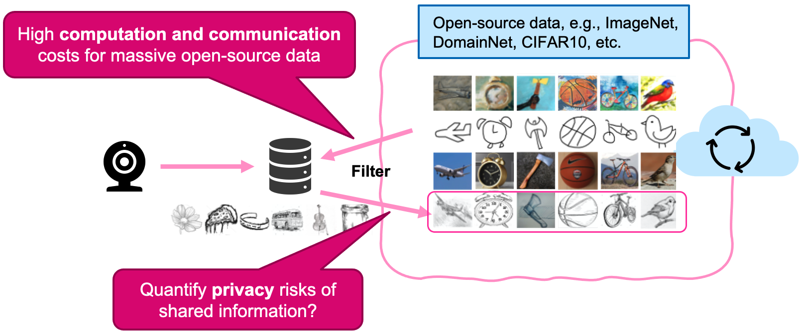
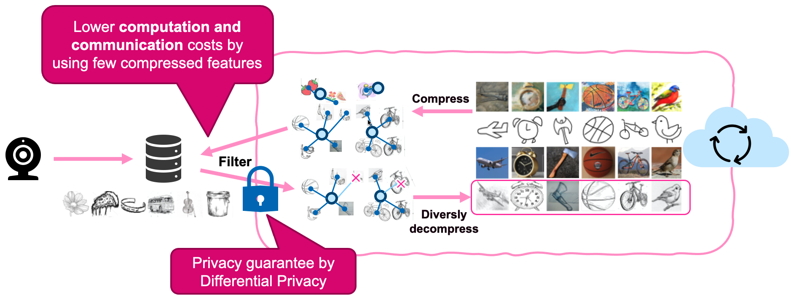
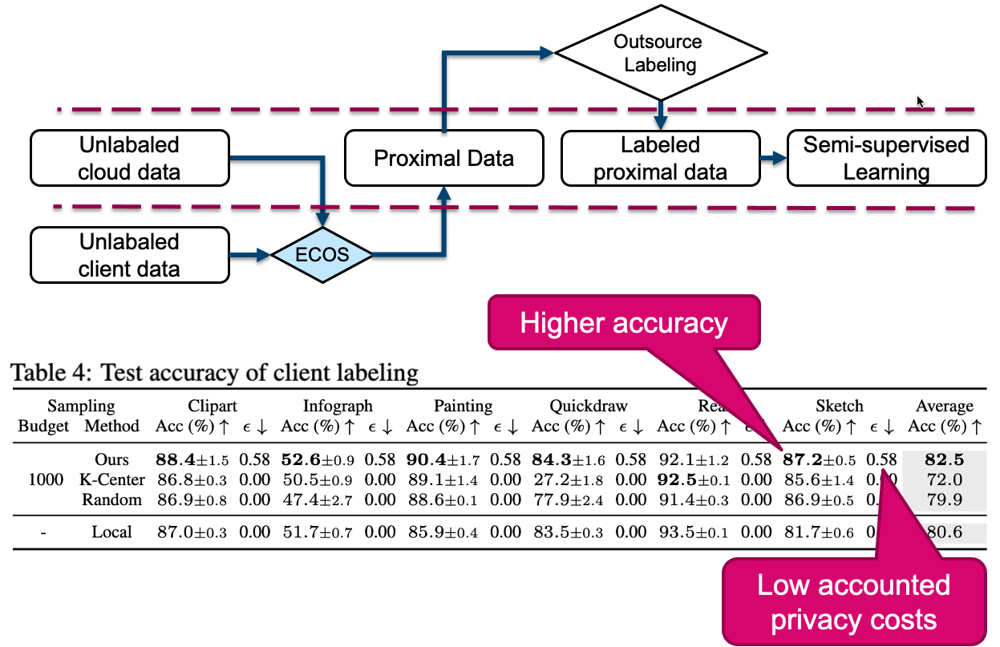

Our work is motivated by the popularity of cloud training, where intelligent edge devices will upload data to the cloud and receive the trained models for predictions, like face recognition, object classification and so on.
Industrial examples include Amazon SageMaker, Microsoft Azure, Cloud Machine Learning Engine by Google. 
Outsourcing training to cloud has empowers many applications of edge intelligence, for example, health care, smart camera, wearable smart devices and so on.

<figure>

<figcaption>Fig 1: Cloud machine learning and privacy risks.</figcaption>
</figure>

However, the solution may encounter concerns when personal data are uploaded by the edge devices.
For instance, the server may find who are using the service by searching for your profile photos in the uploaded database.
A lot of work has been done to defend such information leakage in the machine learning community.
For example, adding Gaussian noise to gradients can protect sample-wise privacy in the notion of differential privacy[^1].
However, adding noise induces great variance to the training and results in inevitable trade-off between accuracy and privacy[^2].
Meanwhile, edge devices usually are not able to collect a large dataset, when privacy-preserving learning is more thirsty for more data or well-learned features[^3].
Here we aim to provide a new idea to defend such risks: __without adding noise to the training or models, but providing sufficient data for training__.

<figure>

<figcaption>Fig 2: Main idea: Outsourcing training without uploading data.</figcaption>
</figure>

Our main idea is that we can find a privacy-free proxy dataset from open-source domains.
*Open-source datasets* are publicly available or authorized for free use.
Trivially, we may send all the open-source data to the edge client for filtering desired samples and conduct training on the cloud accordingly.
You may find many examples online, like ImageNet, DomainNet and CIFAR10.
You can also search for task-related images from the Internet (e.g., Google) using keywords.
Because of the nature of open-source data, we can obtain a great amount of free images for training without adding any noise.
But meanwhile we also face some challenges:
* (**Proximity**) As the open-source data are collected from heterogeneous sources, finding a good proxy dataset is non-trivial. 
* (**Efficiency**) The large volume of open-source casts high computation and communication costs for the edge client to transmit and filter samples.
* (**Privacy**) Though no private data is uploaded, the information exchanged between cloud and the client may still leak private information.

<figure>

<figcaption>Fig 3: Efficient Collaborative Open-source Sampling (ECOS).</figcaption>
</figure>

To improve the efficiency and control privacy risks, we propose a novel sampling paradigm, **Efficient Collaborative Open-source Sampling (ECOS)**.
(1) On the cloud, ECOS first compress the massive open-source data into a small set of low-dimensional centroid features by KMeans clustering.
(2) Then ECOS sends the compressed centroids to the client who returns privacy-protected cluster-scores.
(3) The cloud will diversely sample images from the high-scored clusters for training.

Our method can achieve the aforementioned desired properties.
The small size of low-dimensional centroid features greatly reduces the communication and computation complexity.
Contradicting the local features with the received centroid features can yield distributional similarity by the cluster coverage scores (the number of samples that are close to a cluster).
Therefore, the cloud can filter clusters by the scores.
The scores are privatized by injecting Gaussian noise, which privacy costs are accounted by Differential Privacy, which is estimated by numerical moment accountant[^4].

<figure>

<figcaption>Fig 4: Selective manual labeling.</figcaption>
</figure>

One application of ECOS is the selective manual labeling, where ECOS samples a proximal subset from a large volume of unlabeled open-source data for manual labeling.
The labeled and unlabeled data are used for semi-supervised learning.
As outsourcing labeling is expensive, it is essential to control the budget by limiting the number of samples.
Therefore, a set of high-quality labeled data is important for the high performance of trained models.
In Table 4, we show that the test accuracy by models trained on ECOS samples can outperform baselines and local training (with 1000 samples).
We also provide the accounted privacy cost in terms of $(\epsilon, \delta)$-Differential-Privacy (DP) given $\delta=10^{-5}$.
Though ECOS induces privacy costs by communication with the client, the privacy cost is very low.

Our main contributions can be summarized as follows.
* *New privacy-preserving training*: We find public data in place of the client data for cloud training. 
* *New sampling paradigm*: ECOS is communication- and computation-efficient and private.
* *Flexible on multiple learning tasks*: selective manual labeling, automated client labeling, and adaptive model compression.

We also recognize open questions of the proposed solution for future studies.
For example, the public dataset may require additional data processing, e.g., aligning and cropping for improved prediction accuracy.
In our empirical studies, we only consider the computer vision tasks, though no assumption was made on the data structures. 
We expect the principles to be adapted to other data types with minimal efforts.
More data types, including tabular and natural-language data, will be considered in the follow-up works.

[^1]: Abadi, M., Chu, A., Goodfellow, I., McMahan, H. B., Mironov, I., Talwar, K., & Zhang, L. (2016). Deep Learning with Differential Privacy. _CCS_.
[^2]: Bietti, A., Wei, C.-Y., Dudik, M., Langford, J., & Wu, S. (2022). Personalization Improves Privacy-Accuracy Tradeoffs in Federated Learning. _ICML_.
[^3]: Tramèr, F., & Boneh, D. (2021, February 17). Differentially Private Learning Needs Better Features (or Much More Data). _ICLR_.
[^4]: Wang, Y.-X., Balle, B., & Kasiviswanathan, S. P. (2019). Subsampled Renyi Differential Privacy and Analytical Moments Accountant. _AISTATS_

