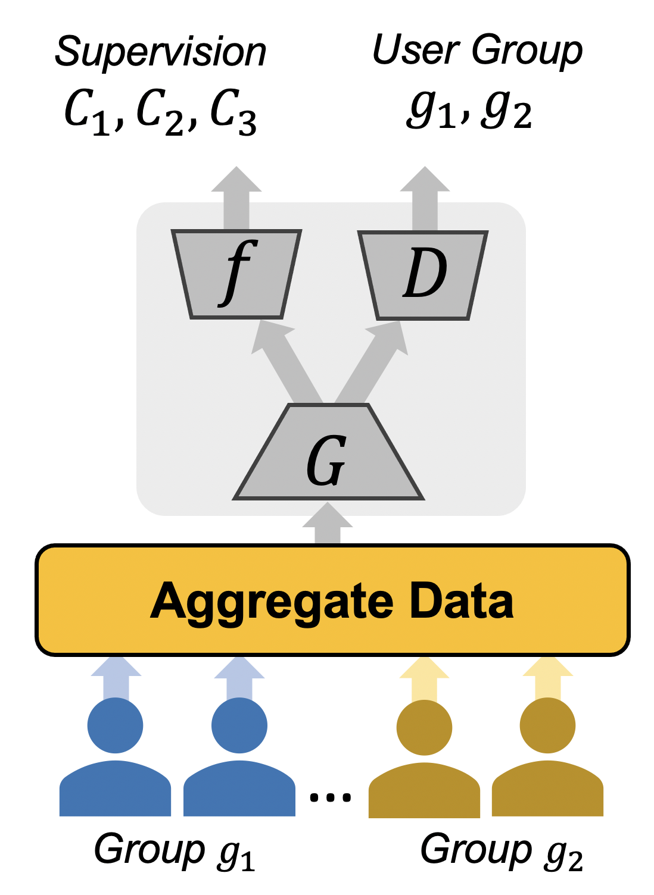
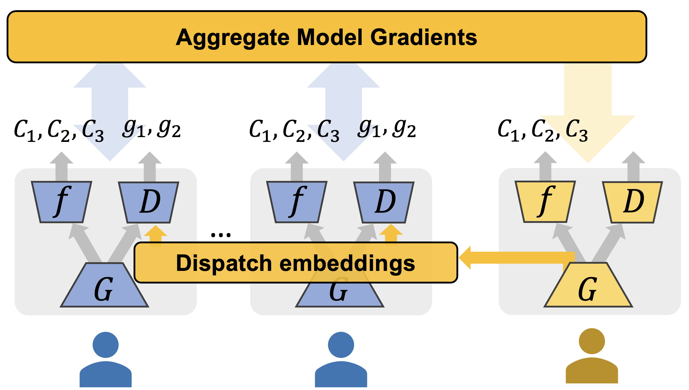
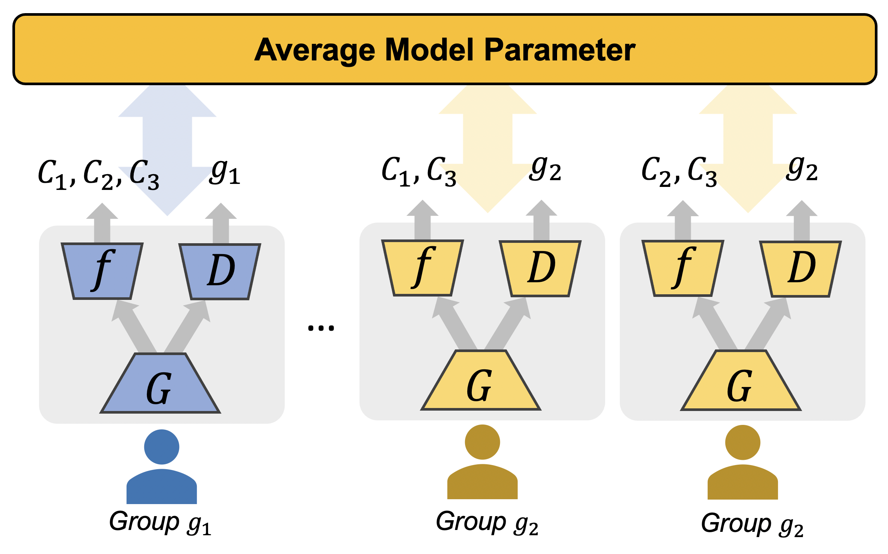
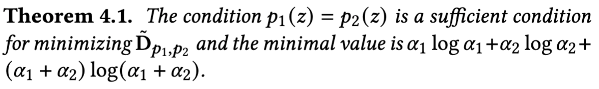
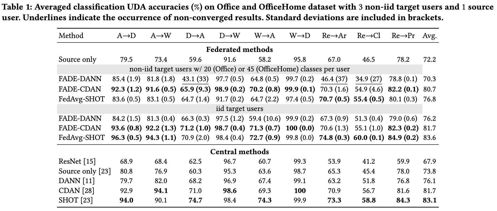
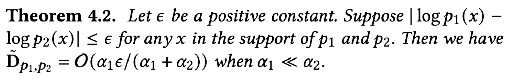
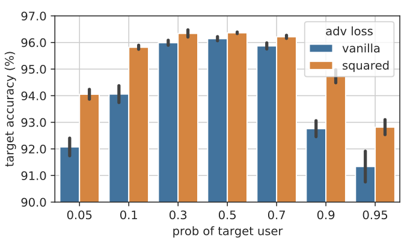
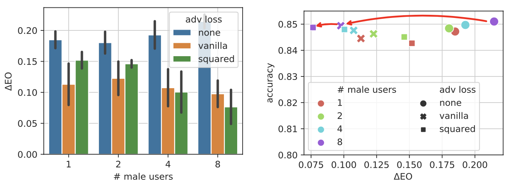

The distribution shift between two groups can be debiased in the representation space.
For example, when the encoder $G$ is fixed, a discriminator network $D$ can be trained to criticize the group discrepancy of samples from two groups [^1].
Meanwhile, we debias the representations by training the encoder $G$ to maximize the discrimination error when fixing the discriminator.
For central learning, the objective is 
$$\min_f \max_g \mathbb{E}_{(x,y, g)} [ \ell_c(f,G; x,y) + \ell_d (D,G; x,g) ]$$
where the debiasing loss is
$$\ell_d = \mathbb{I}(g=0) \log(D(G(x))) + \mathbb{I}(g=1) \log(1 - D(G(x))) $$
and the classifier loss is
$$\ell_c = \text{XEnt}(f(G(x)), y)  $$
where $\text{XEnt}$ is the cross-entropy loss.

<figure>

<figcaption>Fig 1: Central Debiasing</figcaption>
</figure>

However, such a debiasing method is not feasible in a federated setting where users' data will not be aggregated due to the privacy concern.
A recent work[^2] propose to do the adversarial debiasing on the gathered representations.
Either the source domain users or the target domain users has to send their data presentations to the other group.
First, this will increase the communication burden among users.
When $M$ source domain users and $N$ target domain users are involved, the communication occurs $MN$ times.
Second, sharing representations is not safe for privacy, as it is easy to reverse-engineering the representations to obtain the input samples.
Especially, when the encoder is shallow.

<figure>

<figcaption>Fig 2: Unsupervised Federated Domain Adaptation</figcaption>
</figure>

Instead, our method, Federated Adversarial DEbiasing (FADE), does not require users to share their data but only sharing an additional discriminator sub-network.
Just like FedAvg[^3], the shared model help to transfer the useful knowledge in the data while keeping raw data locally.

<figure>

<figcaption>Fig 3: Federated Adversarial Debiasing</figcaption>
</figure>

However, such a method raises new challenges.
First, we will find that the $\ell_d$ has only one side objective.
For example, for group $g=1$, the loss of group $0$ will be missing.
Formally, we will write the federated objective as
$$\min_{f,G} \mathcal{L}(f, G) = \sum_{g=1}^E \sum_{i=1}^{m_g} L_{i,g}(f, G),$$
$$L_{i,g} (f, G) = L_i^{task}(f, G) + \lambda \max_D L_{i,g}^{adv} (G, D),$$
where $L_i^{task}(f, G)$ is the classification loss for the $i$-th user, $L_{i,g}^{adv} (G, D)$ is the adversarial loss and $m_g$ is the number of users in group $g$.
For the two-group case, the adversarial loss can be
$$
\begin{aligned}
  L_{i,g}^{adv} (G, D) = \mathbb{E}_{x\sim p_i(x)} \left[ \mathbb{I}(g=0) \log(D(G(x))) \right. \\\\
  %\mu + \tau\times\eta = \theta \sim N(\mu , \tau^2)
  \left. +\mathbb{I}(g=1) \log(1 - D(G(x))) \right].
  %+ \mathbb{I}(g=1) \log (1 - D(G(x)))
\end{aligned}
$$
The critical problem is if the optimization can converge when the counterpart group is missing.
In other words, we want ask if the distribution matching is a sufficient condition for the minimization.

As shown in Theorem 1.4, it is a sufficient condition for the minimizing the model-measured discrepancy $\tilde D$ between $p_1$ and $p_2$. We also demonstrate the effectiveness by experiments on unsupervised domain adaptation (UDA) benchmarks. The FADE-based achieve performance comparable to central versions. In non-iid and autonomous-user-involving (2 users per round), FADE outperforms the baselines.

### Impact of Imbalanced Groups

We also notice a possible negative impact due to the imbalance of group users.
Suppose the ratio of two group users are $\alpha_1$ and $\alpha_2$, respectively.
Then the sensed discrepancy will be biased as the imbalance is more severer.

To fix this, we propose re-weight the losses according to the loss scales.
That is $\hat \ell = - \ell^2 / 2$ which was used for fair-federated learning.
We compare the vanilla loss versus the squared loss in Fig 4. As more target users are involved, the imbalance is worsened and the squared loss could improve the drop of vanilla losses.

<figure>

<figcaption>Fig 4: Experiments on imbalanced source/target UDA.</figcaption>
</figure>

We also conduct imbalanced experiments in fair federated learning. Squared loss is preferred as imbalance data present, while vanilla loss is preferred in reversed cases.

<figure>

<figcaption>Fig 5: Experiments on imbalanced male/female fair learning.</figcaption>
</figure>

### Impact of Non-iid Users

In addition, the adversarial training may not only debias unwanted distribution shift but also important discriminative information, as class-wise non-iid distributions are present in federated users.
The unwanted debiasing is named user collapse in the scope of this paper.
We argue that using a regularization to limit the user collapse is plausible.
For example, a regularization conditioned on the possible classes is helpful[^4].

<!-- ufda.png "Unsupervised Federated Domain Adaptation" -->

<!-- {}
Click the *Cite* button above to demo the feature to enable visitors to import publication metadata into their reference management software.
{}

{}
Create your slides in Markdown - click the *Slides* button to check out the example.
{} -->

<!-- Supplementary notes can be added here, including [code, math, and images](https://wowchemy.com/docs/writing-markdown-latex/). -->

[^1]: Ganin, Y., & Lempitsky, V. (2015). Unsupervised Domain Adaptation by Backpropagation. ICML, 1180–1189. http://proceedings.mlr.press/v37/ganin15.html
[^2]: Peng, X., Huang, Z., Zhu, Y., & Saenko, K. (2019, September 25). Federated Adversarial Domain Adaptation. ICLR. https://openreview.net/forum?id=HJezF3VYPB
[^3]: McMahan, B., Moore, E., Ramage, D., Hampson, S., & Arcas, B. A. y. (2017). Communication-Efficient Learning of Deep Networks from Decentralized Data. AISTAT, 1273–1282. http://proceedings.mlr.press/v54/mcmahan17a.html
[^4]: Long, M., Cao, Z., Wang, J., & Jordan, M. I. (2018). Conditional Adversarial Domain Adaptation. ArXiv:1705.10667 [Cs]. http://arxiv.org/abs/1705.10667

