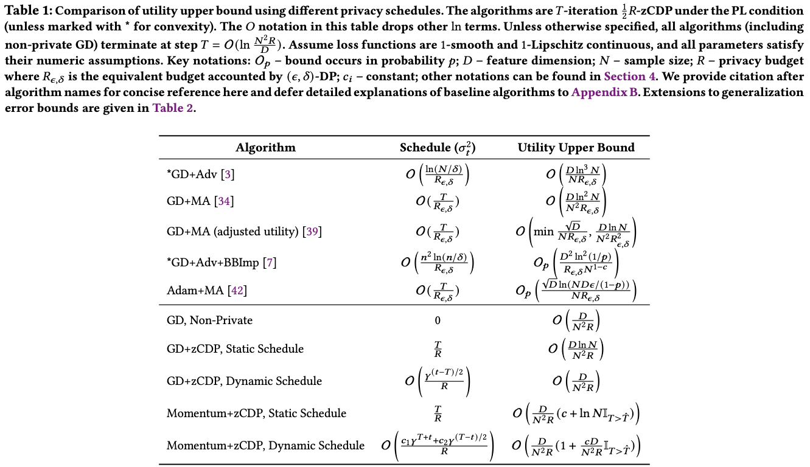
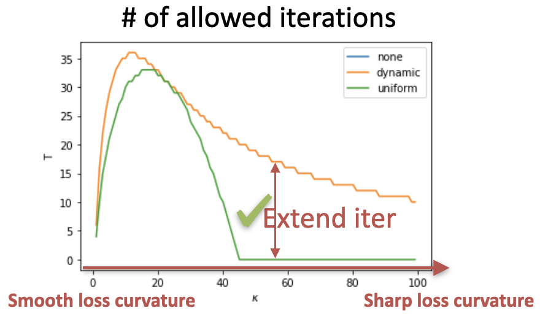
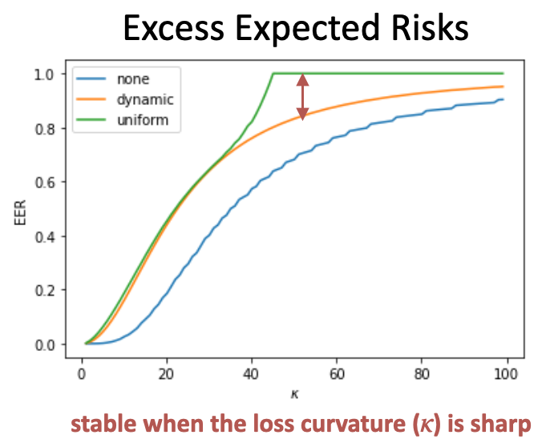

+++
title = "Dynamic Privacy Budget Allocation Improves Data Efficiency of Differentially Private Gradient Descent"
date = 2022-04-07T13:08:20+08:00
draft = false

# Authors. Comma separated list, e.g. `["Bob Smith", "David Jones"]`.
authors = ["admin", "Zhangyang Wang", "Jiayu Zhou"]

# Publication type.
# Legend:
# 0 = Uncategorized
# 1 = Conference paper
# 2 = Journal article
# 3 = Manuscript
# 4 = Report
# 5 = Book
# 6 = Book section
publication_types = ["1"]

# Publication name and optional abbreviated version.
publication = "In *the 2022 ACM Conference on Fairness, Accountability, and Transparency*"
publication_short = "FAccT"

# Abstract and optional shortened version.
abstract = "Protecting privacy in learning while maintaining the model performance has become increasingly critical in many applications that involve sensitive data. Private Gradient Descent (PGD) is a commonly used private learning framework, which noises gradients based on the Differential Privacy protocol. Recent studies show that *dynamic privacy schedules* of decreasing noise magnitudes can improve loss at the final iteration, and yet theoretical understandings of the effectiveness of such schedules and their connections to optimization algorithms remain limited. In this paper, we provide comprehensive analysis of noise influence in dynamic privacy schedules to answer these critical questions. We first present a dynamic noise schedule minimizing the utility upper bound of PGD, and show how the noise influence from each optimization step collectively impacts utility of the final model. Our study also reveals how impacts from dynamic noise influence change when momentum is used. We empirically show the connection exists for general non-convex losses, and the influence is greatly impacted by the loss curvature."
abstract_short = "We analyze the convergence of private gradient descent using dyanmic schedules."

# Featured image thumbnail (optional)
image_preview = ""

# Is this a selected publication? (true/false)
selected = true

# Projects (optional).
#   Associate this publication with one or more of your projects.
#   Simply enter the filename (excluding '.md') of your project file in `content/project/`.
#   E.g. `projects = ["deep-learning"]` references `content/project/deep-learning.md`.
projects = ["private-learning"]

# Tags (optional).
#   Set `tags = []` for no tags, or use the form `tags = ["A Tag", "Another Tag"]` for one or more tags.
tags = ["Privacy", "Classification", "Convergence Analysis", "Dynamic Allocation", "DP", "Selected"]

# Links (optional).
url_pdf = ""
url_preprint = "https://arxiv.org/abs/2101.07413"
url_code = ""
url_dataset = ""
url_project = ""
url_slides = "dyn_dp.pdf"
url_video = ""
url_poster = ""
url_source = ""

# Custom links (optional).
#   Uncomment line below to enable. For multiple links, use the form `[{...}, {...}, {...}]`.
# links = [{name = "Supplementary", url = "l2p_aaai21_supl.pdf"}]

# Does this page contain LaTeX math? (true/false)
math = false

# Does this page require source code highlighting? (true/false)
highlight = true

# Featured image
# Place your image in the `static/img/` folder and reference its filename below, e.g. `image = "example.jpg"`.
[header]
image = ""
caption = ""

+++

Utility upper bounds are a critical metric for privacy schedules, which characterizes the maximum utility
that a schedule can deliver in theory. Wang et al. [34] is the first
to prove the utility bound under the PL condition. Recently, Zhou
et al. proved the utility bound by using the momentum of gradients [17, 25]. In this paper, we improve the upper bound by a
more accurate estimation of the dynamic influence of step noise.
We show that introducing a dynamic schedule further boosts the
sample-efficiency of the upper bound. Table 1 summarizes the upper bounds of a selection of state-of-the-art algorithms based on private gradients (up block, see Appendix B for the full list), and
methods studied in this paper (down block), showing the benefits
of dynamic influence.

Especially, a closely-related work by Feldman et al. achieved
a convergence rate similar to ours in terms of generalization error bounds (c.f. SSGD in Table 2), by dynamically adjusting batch
sizes [11]. However, the approach requires controllable batch sizes,
which may not be feasible in many applications. In federated learning, for example, where users update models locally and then pass
the parameters to server for aggregation, the server has no control
over batch sizes, and coordinating users to use varying batch sizes
may not be realistic. On the other hand, our proposed method can
still be applied for enhancing utility, as the server can dynamically
allocate privacy budget for each round when the presence of a user
in the global aggregation is privatized [21].

In brief, given a sharper loss function, the dynamic budget allocation allows the DPSGD to run for more private iterations and results in lower excess expected risks.

