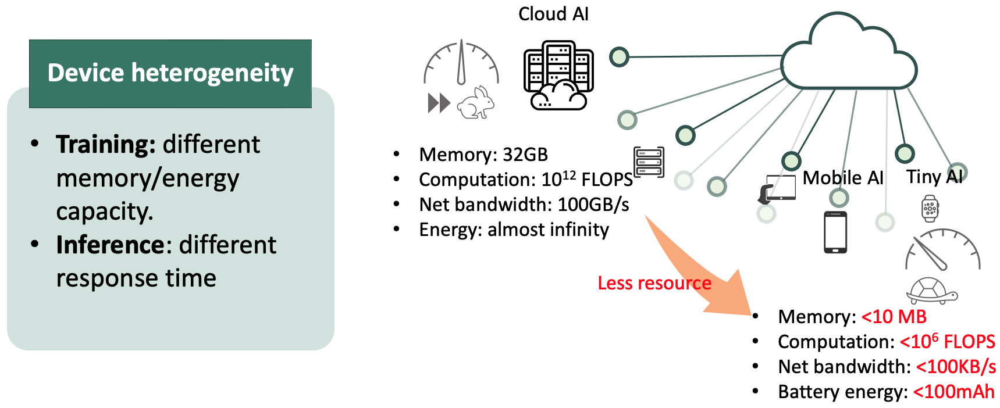

Federated learning (FL)[^1] is a distributed learning paradigm that leverages data from remote participants and aggregates their knowledge without requiring their raw data to be transferred to a central server, thereby largely reducing the concerns from data security and privacy. FedAvg is among the most popular federated instantiations, which aggregates knowledge by averaging models uploaded from different participants.

<figure>

<figcaption>Fig 1: Model customization for dynamic width (efficiency) and robustness.</figcaption>
</figure>

When deploying federated learning, one challenge in real-world applications is the run-time (i.e., test-time) _dynamics_:
The requirements on model properties (e.g., inference efficiency, robustness, etc.) can be constantly changing during the run-time, depending on the status of the devices or the outside environment.
One common and specific type of dynamics is _resource dynamics_: For each application, the allocated on-device resources (e.g., run-time memory, CPU bandwidth, etc.) may vary drastically during run-time, depending on how the resource allocation of the running programs are prioritized on a participant’s device. 
Another type of dynamics is the _robustness dynamics_: The constantly changing outside environment can make different requirements on the safety (or robustness) level of the model.
For instance, the quality of real-time videos captured by autonomous cars can suddenly degrade, e.g., on entering a poor-lighted alley or tunnel from a well-lighted avenue, on entering a section of bumpy road which leads to a sudden burst of blurring in the videos, etc.
In such cases, a more robust model should be quickly switch in and replace the one used on benign conditions, in order to prevent catastrophic accidents caused by wrong recognition under poor visual conditions.
Such dynamic run-time requirements demand the flexibility to customize the model.
The desired model should be able to transform to different variants for dynamic demands of robustness, accuracy and efficiency.

<figure>

<figcaption>Fig 2: Device heterogeneity in federated learning.</figcaption>
</figure>

To effectively and efficiently train models for on-demand an in-situ customization, new challenges will be raised by the ubiquitous _heterogeneity_ of federated learning participants.
Fist, the participants can have _resource heterogeneity_: Different participants have different hardware resources available, such as memory, computing power, and network bandwidth. 
For example, in a learning task for face recognition, clients may use different types of devices (e.g., computers, tablets or smartphones) to participate in learning.
To accommodate different hardware, one can turn to more resource-flexible architectures trained by distillation from ensemble, partial model averaging, or directly combining predictions. 
Specifically, *HeteroFL*[^2] is the first heterogeneous-width solution allowing in-situ model-size switching.
Nevertheless, it suffers from under-training in its large models due to local budget constraints.

<figure>

<figcaption>Fig 3: Feature heterogeneity in federated learning.</figcaption>
</figure>

The degradation could be worsened as facing _data heterogeneity_: The training datasets from participants are not independent and identically distributed (non-i.i.d.).
When one device with a unique data distribution cannot afford training a large model, the global large model may not transfer to the unseen distribution.
Thus, HeteroFL may not provide effective customization such that more parameters brings in higher accuracy and how to train an effectively customizable model still remains unknown.

<figure>

<figcaption>Fig 3: Split-Mix Federated Learning.</figcaption>
</figure>

To address the aforementioned challenges from heterogeneity and dynamics, we study a novel _Split-Mix_ approach to enable FL on heterogeneous devices and achieve _in-situ model customization_ for resource efficiency and robustness:
The size and robustness of the resultant model can be efficiently customized at run-time.
Specifically, we first **split** the complete knowledge in a large model into several small base sub-networks (shards) according to model widths and robustness levels. 
To complete the knowledge, we let the base models be fully trained on all clients. To provide customized models, we **mix** selected base models to construct the desired model size and robustness. 
Overall, our contributions can be summarized in three folds:
* Within the domain of heterogeneous federated learning, we are the first to study training a model with the capability of *in-situ customization* with heterogeneous local computation budgets, which cannot be resolved by existing methods yet.
* To address the challenge, we propose a novel Split-Mix framework that aggregates knowledge from heterogeneous clients into a width- and robustness-adjustable model structure. Remarkably, due to fewer parameters and modular nature, our framework is not only efficient in federated communication and flexibly adaptable to various client budgets _during training_, but also efficient and flexible in storage, model loading and execution _during inference_.
* Empirically, we demonstrate that the performance of the proposed method is better than other FL baselines under heterogeneous budget constraints. Moreover, we show its effectiveness when facing the challenge of data heterogeneity.

[^1]: McMahan, B., Moore, E., Ramage, D., Hampson, S., & Arcas, B. A. y. (2017). Communication-Efficient Learning of Deep Networks from Decentralized Data. AISTATS
[^2]: Diao, E., Ding, J., & Tarokh, V. (2021). HeteroFL: Computation and Communication Efficient Federated Learning for Heterogeneous Clients. _ICLR_.

